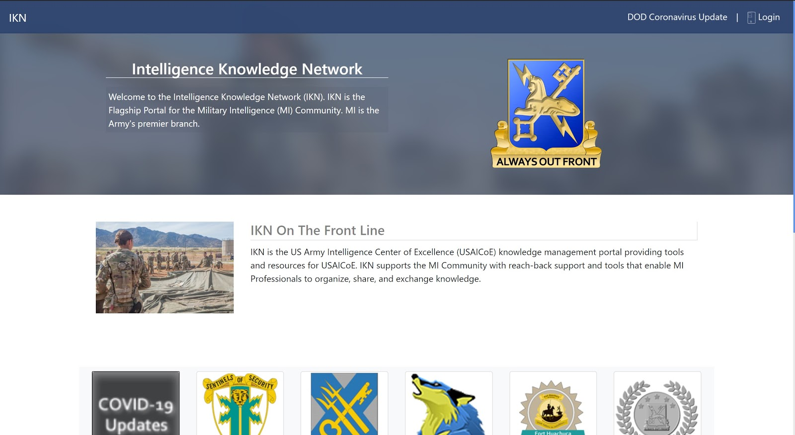
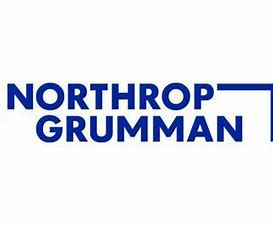

# Tyler Holston

## Work Experience

- **Northrop Grumman (Peraton) Knowledge Management Office, Fort Huachuca, AZ**
    - upcoming/current
    - Web Software Developer - Will be working with C#, Javascript, HTML, CSS, and mySQL to design and develop .NET architectural and framework applications for clients within the United States Army Intelligence Center of Excellence (USAICoE).

- **Northrop Grumman Knowledge Management Office, Fort Huachuca, AZ**
    - 5/20 – 9/20 
    - Software Developer - Applied C#, Javascript, HTML, CSS, and SQL to design, develop, and improve various .NET architectural and framework applications for clients within the United States Army Intelligence Center of Excellence (USAICoE) including assisting with the [IKN Portal](https://www.ikn.army.mil/).  

- **[Northrop Grumman](https://www.northropgrumman.com) Aerospace, Sierra Vista, AZ**
    - 7/19 – 9/19 
    - Software Engineer Intern - Assisted with the Hunter Unmanned Aircraft System transition to a web-based fault tracking system called Bugzilla. Developed small-scale programs to automate data entry using Python programming language. Worked on shelter configuration and installation of Universal Ground Control Station equipment.

## Education
- **University of California - San Diego**

    - 9/19 – current
    - Major in Computer Science and Engineering
    - GPA: 3.64

- **Cochise College**

    - 6/16 – 12/18
    - Dual Enrollment
    - GPA: 4.0

- **Buena High School**

    - 8/15 – 5/19 
    - High School Diploma
    - Class of 2019 Salutatorian
    - GPA: 4.59

## Interests

#### Machine Learning
I am interested in machine learning implementing some basic neural networks to predict the next number in a sequence using [tensorflow](https://www.tensorflow.org/)
> tensorflow is an end-to-end open source machine learning platform

#### Stock Analysis
I am interested in stock analysis implementing sentiment graders and scraping websites where people are actively disucssing stocks to gauge interest in certain stocks and whether there is positive or negative sentiment towards a particular stock. This is an ongoing project of mine and I have completed the following:
- [x] Sentiment grader
- [x] Data filtering/cleaning
- [ ] Data scraping